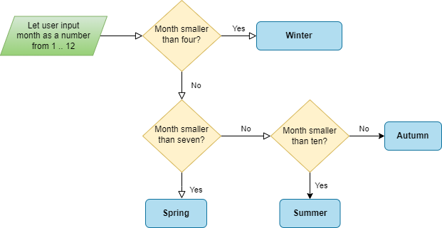

# Week 2 - Tutorial 2: Checking conditions with if statements

Name: SON CAO

Group: ETI1V.IA

Date: 23/09/2005

## Introduction

## Boolean variables

### Activity 1 - Using boolean variables

The program below should read an integer from the user, and use the boolean `positive` to store whether the number is positive or not (a number is positive if it is *greater than* zero).
Currently, the program does not work correctly.
Modify the program so that its output is correct, by changing the value of the `positive` variable based on the value of the `number` variable.

```c
#include <stdio.h>      // for printf
#include <stdbool.h>    // for bool
#include "functions.h"  // for read_int

int main(void) {
    printf("Enter a number: ");
    int number = read_int();
    bool positive = true;

    if (positive) {
        printf("The number is positive\n");
    } else {
        printf("The number is not positive\n");
    }

    return 0;
}
//MY ANSWER:
#include <stdio.h>      // for printf
#include <stdbool.h>    // for bool
#include "functions.h"  // for read_int

int main(void) {
    printf("Enter a number: ");
    int number = read_int();
    bool positive = (number > 0);

    if (positive) {
        printf("The number is positive\n");
    } else {
        printf("The number is not positive\n");
    }

    return 0;
}

```

### Activity 2 - Using boolean expressions

Modify the program listed below so that it does not use any boolean variables, but instead uses boolean expressions.

```c
#include <stdio.h>      // for printf
#include <stdbool.h>    // for bool
#include "functions.h"  // for read_char

int main(void) {
    printf("Enter a character: ");
    char character = read_char();
    bool is_digit = character >= '0' && character <= '9';
    bool is_uppercase = character >= 'A' && character <= 'Z';
    bool is_lowercase = character >= 'a' && character <= 'z';
    if (is_digit) {
        printf("The character is a digit\n");
    } else if (is_uppercase) {
        printf("The character is an uppercase letter\n");
    } else if (is_lowercase) {
        printf("The character is a lowercase letter\n");
    } else {
        printf("The character is not a digit or a letter\n");
    }
    return 0;
}

//MY ANSWER:
#include <stdio.h>      // for printf
#include <stdbool.h>    // for bool
#include "functions.h"  // for read_char

int main(void) {
    printf("Enter a character: ");
    char character = read_char();
    //Using boolean expressions directly in the conditional statements
    if (character >= '0' && character <= '9') {
        printf("The character is a digit\n");
    } else if (character >= 'A' && character <= 'Z') {
        printf("The character is an uppercase letter\n");
    } else if (character >= 'a' && character <= 'z') {
        printf("The character is a lowercase letter\n");
    } else {
        printf("The character is not a digit or a letter\n");
    }
    return 0;
}
```

## If-else if-else chains

### Activity 3 - using if-else if-else chains

The following program contains a lot of `if` statements, with each `if` statement checking a different complex condition.
Modify the program so that it uses a single `if-else if-else` chain instead, which checks the conditions in the following order:

1. If player 1 wins, print "Player 1 wins".
2. Else, if it's a draw, print "It's a draw".
3. Else, player 2 must have won, so print "Player 2 wins".

Note that the program does not take into account invalid input from the user.

```c
#include <stdio.h>      // for printf
#include <stdbool.h>    // for bool
#include "functions.h"  // for read_int

int main(void) {
    printf("Player 1: enter (r)ock, (p)aper or (s)cissors: ");
    char player1 = read_char();
    printf("Player 2: enter (r)ock, (p)aper or (s)cissors: ");
    char player2 = read_char();

    if (player1 == 'r' && player2 == 's' || player1 == 'p' && player2 == 'r' || player1 == 's' && player2 == 'p') {
        printf("Player 1 wins\n");
    }
    if (player1 == player2) {
        printf("It's a draw\n");
    }
    if (player1 == 'r' && player2 == 'p' || player1 == 'p' && player2 == 's' || player1 == 's' && player2 == 'r') {
        printf("Player 2 wins\n");
    }
    
    return 0;
}

//MY ANSWER:
#include <stdio.h>      // for printf
#include <stdbool.h>    // for bool
#include "functions.h"  // for read_int

int main(void) {
    printf("Player 1: enter (r)ock, (p)aper or (s)cissors: ");
    char player1 = read_char();
    printf("Player 2: enter (r)ock, (p)aper or (s)cissors: ");
    char player2 = read_char();

    if (player1 == 'r' && player2 == 's' || player1 == 'p' && player2 == 'r' || player1 == 's' && player2 == 'p'){
        printf("Player 1 wins\n");
    }
        else if (player1 == player2){
            printf("It's a draw\n");
        }
            else{
                printf("Player 2 wins\n");        
    } 
    return 0;
}


```

## Flowcharts

A flowchart is a diagram that represents a process, showing the steps as boxes of various kinds, and their order by connecting these with arrows.
Flowcharts can be used to describe the logic of a program, and can help you understand the structure of a program before you start writing it.

A good exercise to help you understand the `if-else if-else` chain is to implement a program that is given as a flowchart.

### Activity 4 - Implement a program based on a flowchart

The flowchart below describes a program that reads the month from the user, and determines the season of the month.
Implement this program in C - a starting point is already provided for you.



```c
#include <stdio.h>      // for printf
#include "functions.h"  // for read_int

// program to determine the season of a month, based on the
// given flowchart

int main(void) {
    printf("This program will tell the season given a month\n");
    printf("Enter the month as a number (1-12): ");
    int month = read_int();
        if (month < 4){
            printf("It's Winter!\n");
        }
            else if (4 <= month && month < 7){
                printf("It's Spring!\n");
            }
            else if (7 <= month && month < 10){
                printf("It's Summer!\n");
            }
                else{
                    printf("It's Autumn!\n");
                }
    return 0;
}
```

## Using the compiler to detect possible problems with your program

When using `if`-statements, the complexity of your program can increase.
This means that it is easier to make mistakes, and harder to find them.
The compiler can help you find some of these mistakes by enabling warnings when compiling your program.

### Activity 5 - Find the problems

The program below contains a number of problems.
To find these problems, compile the program below with warnings enabled (use the `-Wall` flag), and list the warnings that the compiler generates.
Explain what these warnings mean, and how you can fix it.

Copy the command you used to compile the program, and the warnings that were generated, into the markdown file.

```c
#include <stdio.h>      // for printf
#include "functions.h"  // for read_int

int main(void) {
    printf("Enter your age: ");
    int age = read_int();

    if (age = 0) {
        printf("You are a baby\n");
    } else if (age < 18) {
        printf("You are a minor\n");
    } else if (age < 65) {
        printf("You are an adult\n");
    } else if (age = 100) {
        printf("You are a centenarian!\n");
    } else {
        printf("You are a senior citizen\n");
    }

    return 0;
}

//MY ANSWER:
-The command used to compile: gcc -Wall -o program ttr1w2.c functions.c
-The warnings that were generated: 
ttr1w2.c: In function ‘main’:
ttr1w2.c:8:9: warning: suggest parentheses around assignment used as truth value [-Wparentheses]
    8 |     if (age = 0) {
      |         ^~~
ttr1w2.c:14:16: warning: suggest parentheses around assignment used as truth value [-Wparentheses]
   14 |     } else if (age = 100) {
      |                ^~~

```


## Sign off

To sign off this tutorial, you will need to demonstrate the following things:

* You can use `bool` variables to store the results of boolean expressions.
* You can check `bool` variables and expressions with `if` statements.
* You have answered all questions in the markdown file, and have submitted it at the correct submit point in Brightspace

Once you've successfully demonstrated the items listed above, your lab teacher will mark the tutorial as completed.
You'll need to sign off this tutorial before you can continue with the assignments of this week.
