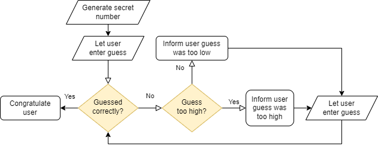

# Week 3 - Tutorial 1: Looping with while and for

Name: SON CAO

Group: ETI1V.IA

Date: 16/09/2024

## Introduction

In this tutorial, you will learn how to repeat code using loops.
There are two main types of loops in C: the `while` loop, and the `for` loop.
You will learn how to use these loops to repeat code, and how to use them to solve problems.

### Activity 0 - Update the system

Before you start with this tutorial, make sure your system is up-to-date by running the following commands in the terminal:

```bash
sudo apt update
sudo apt upgrade
```

### Activity 1 - Set up a folder for this tutorial

Create a folder (directory) for this week's tutorial in your preferred location.
Open up the folder in VS code by selecting the folder in the File->Open menu, or by right-clicking on the folder in your file browser and selecting "Open in VS Code" (if this option is available).

Alternatively, you can open the folder from a WSL terminal by typing the `code .` command.

## Validating input with loops

When you ask the user for input, you cannot always trust that the user will enter the correct input.
To ensure that the input is correct, you can use a loop to keep asking the user for input until the input is valid.

### Activity 2 - Validating input with a while loop

The following program asks the user to enter a digit character, and stores it in the `character` variable.
Currently, the program does check if the input is a digit character (using the `isdigit` function), but if the user did not enter a digit character, the program will not ask the user for input again.
Modify the program so that it keeps asking the user for input until the input is a digit character.
**Restrictions**: you are not allowed to use the `break` or `continue` statement in your program, and the program must use a single variable (i.e. the `character` variable that already is there).

Store the modified program in a file called `activity2.c` in the folder for this tutorial.
Copy the code you wrote into the markdown file when you're done.

```c
#include <stdio.h>      // for printf
#include <ctype.h>      // for isdigit
#include "functions.h"  // for read_char

int main(void) {
    printf("Enter a digit: ");
    char character = read_char();

    if (isdigit(character)) {
        printf("You entered the digit %c\n", character);
    }

    return 0;
}
//MY ANSWER!!!!!!!!!!!!!!!!!!!!!!!!!!!!!:
#include <stdio.h>      // for printf
#include <ctype.h>      // for isdigit
#include "functions.h"  // for read_char

int main(void) {
    char character;
    do{
        printf("Enter a digit: ");
        character = read_char();
    } while (!isdigit(character));
        printf("You entered the digit %c\n", character);
    
    return 0;
}


```

Very often, the conditions that you want to check are more complex than just checking if a single variable is equal to a value.
In these cases, the conditions can be combined using boolean operators, such as `&&` (and), `||` (or), and `!` (not).

### Activity 3 - Complex conditions

The program below asks the user to choose between "rock", "paper", or "scissors", by entering the corresponding letter.
Currently, the program does not check if the input is valid.

Modify the program so that it keeps asking the user for input until the input is valid.
**Restrictions**: you are not allowed to use the `break` or `continue` statement in your program, and the program must use a single variable (i.e. the `choice` variable).

Store the modified program in a file called `activity3.c` in the folder for this tutorial.
Copy the code you wrote into the markdown file when you're done.


```c
#include <stdio.h>      // for printf
#include "functions.h"  // for read_char

int main(void) {
    printf("Enter (r)ock, (p)aper or (s)cissors: ");
    char choice = read_char();

    if (choice == 'r') {
        printf("You chose rock\n");
    } else if (choice == 'p') {
        printf("You chose paper\n");
    } else if (choice == 's') {
        printf("You chose scissors\n");
    } else {
        // TODO: repeat if choice was neither 'r', 'p', or 's'
        printf("Invalid choice, try again!\n");
    }

    return 0;
}
//MY ANSWER!!!!!!!!!!!!!!!!!!!!!!!!!!!!!!!:
#include <stdio.h>      // for printf
#include "functions.h"  // for read_char

int main(void) {
    char choice;
    do
    {
        printf("Enter (r)ock, (p)aper or (s)cissors: ");
        char choice = read_char();
    
        if (choice == 'r') {
            printf("You chose rock\n");
    }   else if (choice == 'p') {
            printf("You chose paper\n");
    }   else if (choice == 's') {
            printf("You chose scissors\n");
    }   else {
            printf("Invalid choice, try again!\n");
    }
    
    }   while (choice != 'r' && choice != 'p' && choice != 's');
    
    return 0;
}
```

## Loops and flowcharts

In the previous week, you've met flowcharts in the context of conditional (`if`) statements.
Flowcharts can contain loops as well, which illustrates that a certain part is repeated until a certain condition is met.
This naturally maps to the `while` loop in C.

### Activity 4 - Implement a program based on a flowchart

The flowchart below describes a program that generates a number between 1 and 100, and then lets the user guess the number, informing the user whether the guess was too high, too low, or correct.

Implement this program in C - a starting point is already provided for you.
Store the program in a file called `activity4.c` in the folder for this tutorial.
Copy the code you wrote into the markdown file when you're done.



```c
#include <stdio.h>      // for printf
#include "functions.h"  // for read_int, random_int

// program to play a number-guessing game, based on the given flowchart

int main(void) {
    int secret = random_int(1, 100);
    printf("I'm thinking of a number between 1 and 100, can you guess it?\n");
    printf("Guess the number (1-100): ");
    int guess = read_int();
    while (guess != secret){
        if(guess > secret){
            printf("It's too high!\n");
        }
            else{
                printf("It's too low!\n");
            }
    printf("Guess the number (1-100): ");
    guess = read_int();    
    }

    printf("Congratulation!");

    return 0;
}
```

## Counting things with loops

Loops can be used to count things, by incrementing a counter variable each time a certain condition is met.
Similarly, loops can be used to sum things, by adding a value to a sum variable each time a certain condition is met.
Variables that are used to count or sum things are often called *accumulator variables*.

Counting (or summing) is done by updating a variable that is outside the loop, from inside the loop.
It is important to initialize the counter variable before the loop, otherwise the value of the counter variable will be undefined.

The program listed below counts the number of times the user enters a non-zero number.
As soon as the user enters a zero, the program stops counting and prints the total number of non-zero numbers entered.

```c
#include <stdio.h>      // for printf
#include "functions.h"  // for read_int

int main(void) {
    int count = 0;
    printf("Enter a number: ");
    int number = read_int();

    while (number != 0) {
        count++;
        printf("Enter a number: ");
        number = read_int();
    }

    printf("You entered %d non-zero numbers\n", count);

    return 0;
}
```

### Activity 5 - Print the average

Modify the program listed above so that it also prints the *average* of the non-zero numbers entered.
In case the user enters a zero as the first number, the program should print "No numbers entered", in order to avoid division by zero.
Be aware that the average is a floating-point number, so you'll need to use a `float` (or `double`) variable to store the sum of the numbers.

Store the modified program in a file called `activity5.c` in the folder for this tutorial.
Copy the code you wrote into the code block listed below when you're done:

```c
// TODO: Include your program by copying and pasting it into this code block.
#include <stdio.h>      // for printf
#include "functions.h"  // for read_int

int main(void) {
    int count = 0;
    float sum = 0.0;

    printf("Enter a number: ");
    int number = read_int();

    while (number != 0) {
        sum += number;
        count++;
        printf("Enter a number: ");
        number = read_int();
    }

    if (count == 0) {
        printf("No numbers entered\n");  
    } else {
        printf("You entered %d non-zero numbers\n", count);
        printf("Average of the numbers entered: %.2f\n", sum / count);  
    }

    return 0;
}
```


### Activity 6 - Average of at most 10 numbers

Copy the program of the last activity into a file called `activity6.c` in the folder for this tutorial.
Next, modify the program in `activity6.c` so that it stops counting after the user has entered 10 non-zero numbers: after the user has either entered 10 non-zero numbers, or entered a zero, the program should print the total number of non-zero numbers entered, and the average of the non-zero numbers.

Copy the code you wrote into the code block listed below when you're done:

```c
// TODO: Include your program by copying and pasting it into this code block.

#include <stdio.h>      // for printf
#include "functions.h"  // for read_int

int main(void) {
    int count = 0;
    float sum = 0.0;

   
    while (count < 10) {
        printf("Enter a number: ");
        int number = read_int();
   
    if (number == 0) {
            break;
    }

        sum += number;
        count++;
        }
       
    if (count == 0) {
        printf("No numbers entered\n");  
    } else {
        printf("You entered %d non-zero numbers\n", count);
        printf("Average of the numbers entered: %.2f\n", sum / count);  
    }

    return 0;
}
```

## Sign off

To sign off this tutorial, you will need to demonstrate the following things:

* You can use a `while` loop to repeat code until a certain condition is met.
* You can use a `for` loop to repeat code a certain number of times.
* You have tested the programs you've written in this tutorial, and they work as expected.
* You have answered all questions in the markdown file, and have submitted it at the correct submit point in Brightspace

Once you've successfully demonstrated the items listed above, your lab teacher will mark the tutorial as completed.
You'll need to sign off this tutorial before you can continue with the next one.
