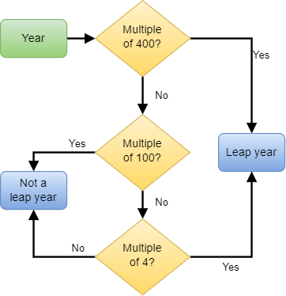

# Week 4 - Tutorial 2: Decomposing programs with functions

Name: SON CAO

Group: ETI1V.IA

Date: 24/09/2024

## Introduction

Before writing a program, it is important to think about how to structure it.
A good way to structure a program is to divide it into smaller parts, each of which performs a specific task.
Each of these smaller parts can then be implemented as a function that has clear input (i.e., parameters) and output (i.e., return value).

In this tutorial, you will write several functions that perform specific tasks, and then combine these functions to create a larger program.

### Activity 0 - Set up a folder for this tutorial

Create a folder (directory) for this week's tutorial in your preferred location, and copy the files [`functions.h`](../code/functions.h) and [`functions.c`](../code/functions.c) into this folder.

It's recommended to have a folder for each week, and within that folder a folder for each tutorial, to keep your work organized.
Open up the folder in VS code by selecting the folder in the File->Open menu, or by right-clicking on the folder in your file browser and selecting "Open in VS Code" (if this option is available).

Alternatively, you can open the folder from a WSL terminal by typing the `code .` command.

## Days of your life

The program that you will compose in this tutorial will calculate the number of days you have lived.
This involves calculating the number of days between your birthdate and today, taking into account leap years.
You will compose this program step by step by writing functions that perform specific tasks.
Each function will be tested separately before combining them into the final program.

### Determining leap years

A leap year is a year that is divisible by 4, except for years that are divisible by 100, unless they are also divisible by 400.
The following flowchart describes how to determine if a year is a leap year:



#### Activity 1 - Function for determining leap years

Create a new file `main.c` in the folder for this tutorial.
In this and the next activities, you will write several functions and add them to this file.

Write a function `is_leap_year` that takes an integer parameter `year` and returns a boolean value indicating whether the given year is a leap year.
The function must implement the flowchart that is pictured above.
The prototype of the function is given below, as well as some code that tests the function with some example years.:

```c
/// Determines if a given year is a leap year.
/// @param year The year to check.
/// @return true if the year is a leap year, false otherwise.
bool is_leap_year(int year);

int main(void) {
    // Test the function with some example years
    if (is_leap_year(2000)) printf("2000 is a leap year\n");
    else printf("2000 is not a leap year\n");
    if (is_leap_year(2001)) printf("2001 is a leap year\n");
    else printf("2001 is not a leap year\n");
    if (is_leap_year(1900)) printf("1900 is a leap year\n");
    else printf("1900 is not a leap year\n");
    if (is_leap_year(2004)) printf("2004 is a leap year\n");
    else printf("2004 is not a leap year\n");

    return 0;
}
```

Verify that the function works correctly by running the program and checking the output - it should indicate that 2000 and 2004 are leap years, and 2001 and 1900 are not.

### Determining the number of days in a month

The number of days in a month depends on the month and the year.
For the month February, it even depends on the year - February has 29 days in a leap year, and 28 days in a non-leap year.

#### Activity 2 - Function for determining the number of days in a month

Write a function `days_in_month` (in the `main.c` file) that takes two integer parameters `month` and `year`, and returns the number of days in the given month of the given year.
The function must use the `is_leap_year` function that you wrote in the previous activity to determine the number of days in February.

The prototype of the function is given below, as well as some code that tests the function with some example months and years:

```c
/// Determines the number of days in a given month of a given year.
/// @param month The month (1-12) to check.
/// @param year The year to check.
/// @return The number of days in the given month of the given year.
int days_in_month(int month, int year);

int main(void) {
    // Test the function with some example months and years
    printf("There are %d days in month 2 of year 2000\n", days_in_month(2, 2000));
    printf("There are %d days in month 2 of year 2001\n", days_in_month(2, 2001));
    printf("There are %d days in month 1 of year 2000\n", days_in_month(1, 2000));
    printf("There are %d days in month 12 of year 2000\n", days_in_month(12, 2000));

    return 0;
}
```

Verify that the function works correctly by running the program and checking the output - it should indicate that there are 29 days in February 2000, 28 days in February 2001, and 31 days in January and December of 2000.

### Calculating the day in the year

The day in the year is the number of days that have passed since the beginning of the year.
For example, January 1st is day 1, January 2nd is day 2, and so on.
In leap years, February 29th is day 60, since February has 29 days in a leap year.

To compute the day in the year, you can use a loop that iterates over all months from January to the month before the given month, and adds the number of days in each month to the total.

#### Activity 3 - Function for calculating the day in the year

Write a function `day_in_year` (again, in the `main.c` file) that takes three integer parameters `day`, `month`, and `year`, and returns the day in the year for the given date.
The function must use the `days_in_month` function that you wrote in the previous activity to determine the number of days in each month.

The prototype of the function is given below, as well as some code that tests the function with some example dates:

```c
/// Calculates the day in the year for a given date.
/// @param day The day of the month (1-31).
/// @param month The month (1-12).
/// @param year The year.
/// @return The day in the year for the given date.
int day_in_year(int day, int month, int year);

int main(void) {
    // Test the function with some example dates
    printf("The day in the year for 1-1-2000 is %d (should be 1)\n", day_in_year(1, 1, 2000));
    printf("The day in the year for 29-2-2000 is %d (should be 60)\n", day_in_year(29, 2, 2000));
    printf("The day in the year for 31-12-2000 is %d (should be 366)\n", day_in_year(31, 12, 2000));
    printf("The day in the year for 31-12-1900 is %d (should be 365)\n", day_in_year(31, 12, 1900));

    return 0;
}
```

Verify that the function works correctly by running the program and checking the output - it should indicate that January 1st 2000 is day 1, February 29th 2000 is day 60, December 31st 2000 is day 366, and December 31st 1900 is day 365.

#### Activity 4 - Function for calculating the remaining days in the year

Add another function to the `main.c` file: write a function `remaining_days_in_year` that takes three integer parameters `day`, `month`, and `year`, and returns the number of days remaining in the year for the given date (excluding that date).
This can be calculated by subtracting the day in the year from the total number of days in the year (365 or 366, depending on whether it is a leap year).
For example, the number of days remaining in the year for December 31st is 0, as there are no days left in the year.
For January 1 in a leap year, the number of days remaining is 365, as there are 365 days left in the year _after_ January 1st.

The prototype of the function is given below, as well as some code that tests the function with some example dates:

```c
/// Calculates the number of days remaining in the year for a given date.
/// @param day The day of the month (1-31).
/// @param month The month (1-12).
/// @param year The year.
/// @return The number of days remaining in the year for the given date.
int remaining_days_in_year(int day, int month, int year);

int main(void) {
    // Test the function with some example dates
    printf("There are %d days remaining in the year for 1-1-2000 (should be 365)\n", remaining_days_in_year(1, 1, 2000));
    printf("There are %d days remaining in the year for 29-2-2000 (should be 306)\n", remaining_days_in_year(29, 2, 2000));
    printf("There are %d days remaining in the year for 31-12-2000 (should be 0)\n", remaining_days_in_year(31, 12, 2000));
    printf("There are %d days remaining in the year for 31-12-1900 (should be 0)\n", remaining_days_in_year(31, 12, 1900));

    return 0;
}
```

Verify that the function works correctly by running the program and checking the output.

### Computing the number of days between two dates

The final step is to write a function that calculates the number of days between two dates.
This number can be calculated by summing the number of days in each year between the two dates, and subtracting the day in the year for the first (earliest) date and the remaining days in the year for the second (latest) date.

For example, the number of days between February 1st 2000 and December 1st 2001 can be calculated as follows:

1. Sum the number of days in the years 2000 and 2001 (this will give 366 + 365 = 731 days).
2. Subtract the day in the year for February 1st 2000 (day 32) from the total (this will give 731 - 32 = 699 days).
3. Subtract the remaining days in the year for December 1st 2001 (30 days) from the result (this will give 699 - 30 = 669 days).

#### Activity 5 - Function for calculating the number of days between two dates

Write a function `days_between_dates` that takes six integer parameters `day1`, `month1`, `year1`, `day2`, `month2`, and `year2`, and returns the number of days between the two dates.
The function must assume that the first date (given by `day1`, `month1` and `year1`) is earlier than the second date.

The prototype of the function is given below, as well as some code that tests the function with some example dates:

```c
/// Calculates the number of days between two dates.
/// @param day1 The day of the first date (1-31).
/// @param month1 The month of the first date (1-12).
/// @param year1 The year of the first date.
/// @param day2 The day of the second date (1-31).
/// @param month2 The month of the second date (1-12).
/// @param year2 The year of the second date.
/// @return The number of days between the two dates.
int days_between_dates(int day1, int month1, int year1, int day2, int month2, int year2);

int main(void) {
    // Test the function with some example dates
    printf("There are %d days between 1-1-2000 and 1-1-2001 (should be 366)\n", days_between_dates(1, 1, 2000, 1, 1, 2001));
    printf("There are %d days between 1-1-2000 and 1-1-2002 (should be 731)\n", days_between_dates(1, 1, 2000, 1, 1, 2002));
    printf("There are %d days between 1-1-2000 and 1-1-2003 (should be 1096)\n", days_between_dates(1, 1, 2000, 1, 1, 2003));

    return 0;
}
```

Again, verify that the function works correctly by running the program and checking the output.

### Putting it all together

Now that you have written all the functions, you can combine them into a single program that calculates which day of your life the current date is.
The program should prompt the user to enter their birthdate, and then calculate the number of days they have lived.
To obtain the current date, use the function `get_current_date` that is provided through the `functions.h` file.

#### Activity 6 - Final program

Write a program that calculates which day of your life the current date is.
The program should use the functions that you have written in the previous activities to calculate the number of days between the birthdate and the current date.
Part of the program is already listed below (it uses a concept - arrays - that will be introduced in week 5, but don't worry about that for now), put the rest of the program in the space provided:

```c
#include <stdio.h>      // for printf
#include "functions.h"  // for read_int, get_current_date

// Put the functions that you have written here

int main(void) {
    // Get the current date
    int current_date[3];    // day, month, year
    get_current_date(current_date);
    int current_year = current_date[2];     // the current year
    int current_month = current_date[1];    // the current month
    int current_day = current_date[0];      // the current day

    // Get the birthdate from the user
    printf("Enter de day of your birthdate: ");
    int day = read_int();
    printf("Enter the month of your birthdate: ");
    int month = read_int();
    printf("Enter the year of your birthdate: ");
    int year = read_int();

    // TODO: Calculate the number of days between the birthdate and the current date
    int days_lived = 42;    // FIXME: replace this with the correct calculation

    // Print the result
    printf("Today is the %dth day of your life\n", days_lived);

    return 0;
}
```

### Splitting into header and source files

In the final program, you have written all the functions in the same file as the `main` function.
In practice, it is better to split the program into multiple files: a header file (`.h`) that contains the function prototypes, and a source file (`.c`) that contains the function implementations.
This makes the program easier to read and maintain, and allows you to reuse the functions in other programs.

#### Activity 7 - Splitting the program

Create two new files called `days.h` and `days.c` in the folder for this tutorial.
Copy the function prototypes from the `main` file into the `days.h` file, and the function definitions (except the `main` function) into the `days.c` file. Note that you will need to include the `stdio.h` and `functions.h` files in the `days.c` file, just like you include them in the `main` file.

Modify the `main` file to include the `days.h` file, just like it includes the `stdio.h` and `functions.h` files.

Make sure that the program still compiles and runs correctly after splitting it into multiple files, by running the following commands in the terminal:

```bash
gcc -Wall -o activity7 days.c main.c functions.c
./activity7
```

If the program compiles without errors & warnings, and runs successfully, then you've completed this activity.

List the contents of the `days.h` file in the code block below:

```c
// TODO: include the contents of days.h here
/// Determines if a given year is a leap year.
/// @param year The year to check.
/// @return true if the year is a leap year, false otherwise.
bool is_leap_year(int year);

/// Determines the number of days in a given month of a given year.
/// @param month The month (1-12) to check.
/// @param year The year to check.
/// @return The number of days in the given month of the given year.
int days_in_month(int month, int year);

/// Calculates the day in the year for a given date.
/// @param day The day of the month (1-31).
/// @param month The month (1-12).
/// @param year The year.
/// @return The day in the year for the given date.
int day_in_year(int day, int month, int year);

/// Calculates the number of days remaining in the year for a given date.
/// @param day The day of the month (1-31).
/// @param month The month (1-12).
/// @param year The year.
/// @return The number of days remaining in the year for the given date.
int remaining_days_in_year(int day, int month, int year);

/// Calculates the number of days between two dates.
/// @param day1 The day of the first date (1-31).
/// @param month1 The month of the first date (1-12).
/// @param year1 The year of the first date.
/// @param day2 The day of the second date (1-31).
/// @param month2 The month of the second date (1-12).
/// @param year2 The year of the second date.
/// @return The number of days between the two dates.
int days_between_dates(int day1, int month1, int year1, int day2, int month2, int year2);
```

## Sign off

To sign off this tutorial, you will need to have done the following:

* You have answered all questions in the markdown file, and all programs you've created compile and run without errors.
* You converted the markdown file to HTML, and submitted it at the correct submit point in Brightspace.

Your lab teacher will mark the tutorial as completed in Brightspace.
In case there are issues with your programs or answers, your lab teacher will get in touch with you.
