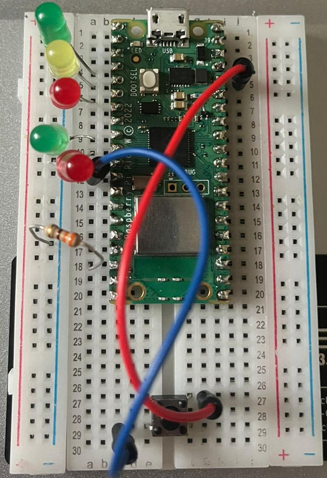
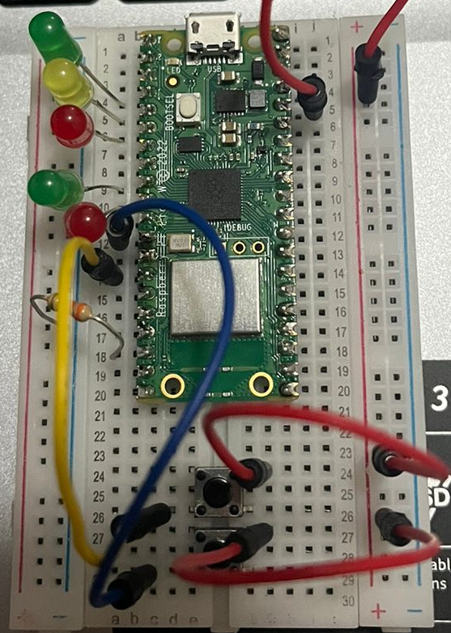
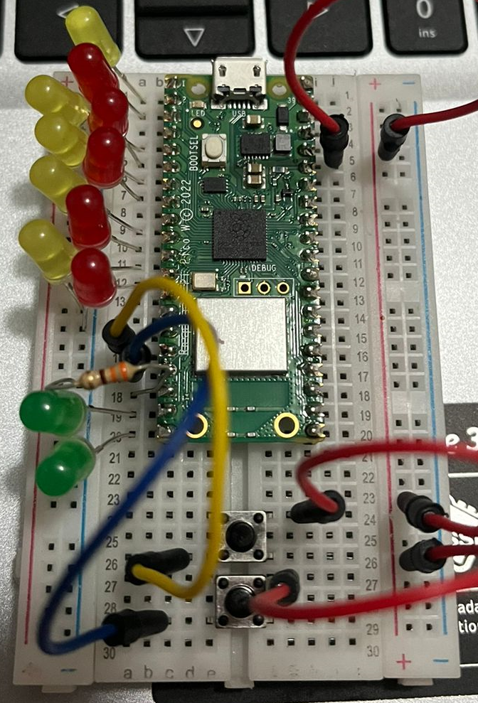

# Week 4 - Session 1: State Machines

> **Name:** SON CAO
> 
> **Group:** ETI1V.IA
> 
> **Date:** 5/12/2024

## Introduction

In this final week of the course, we will take a look at one of the most important architectural concepts in embedded software: State Machines.

This is the list of needed equipment for this tutorial (everything is included in your kit):
- Raspberry Pi Pico board (with USB cable, headers soldered)
- Breadboard
- Jumper wires
- 5 LED
- 2 Buttons

## Activity 1: Introduction to State Machines
**Description: Trimodal LED**

A finite state machine (FSM) is a mathematical model of computation. It is an abstract machine that can be in one of a finite number of states at any given time. The FSM can change from one state to another in response to some inputs. The change from one state to another is called a transition. An FSM is defined by a list of its states, its initial state, and the conditions for each transition. But you should know that already from the Digital course! It is a useful tool to model digital systems, but it is also great for programming embedded systems. 

In this activity, we will implement a simple state machine that controls the behavior of an LED. The activity is based on the final session (Assignment 6) of the Digital course. The LED can be in one of three states: off, continuous on, or blinking. The transitions between the states are controlled by one button that cycles through the states when pressed. First, if you still have it take the state diagram you created for the Digital course. If you don't have it, you can quickly draw it now.

To help you get started here are the main parts of the code you will need to implement the state machine:

### State definitions
We will use the enumeration type you have learned about in Programming course to define the states of the LED. The states are `OFF`, `CONTINUOUS`, and `BLINKING`. This way when you read the code, you can easily see what state the system is in. 

```c
typedef enum {
    OFF,
    CONTINUOUS,
    BLINKING
} state_t;

state_t state = OFF;
```

### Next state function / Input decoder
To implement the state machine, you will need a function that determines the next state based on the current state and the input. This function will be called in the main loop of your program. For best readability, you can use a switch-case statement to handle the different states and transitions. 

```c
void next_state() {
    switch (state) {
        case OFF:
            if (button_pressed()) {
                state = CONTINUOUS;
            }
            break;
        case CONTINUOUS:
            if (button_pressed()) {
                state = BLINKING;
            }
            break;
        case BLINKING:
            if (button_pressed()) {
                state = OFF;
            }
            break;
    }
}
```

### State action function / Output decoder
Finally, you will need a function that performs the actions associated with each state. In this case, you will turn the LED on or off based on the state. 

```c
#include "pico/stdlib.h" // Standard library for Pico

typedef enum {
    OFF,
    CONTINUOUS,
    BLINKING
} state_t;

state_t state = OFF; 

bool button_pressed(uint PIN_BUTTON){
    bool status = false;
    static bool previous_state = false;
    // Read the button state and light the LED
    bool button_state = gpio_get(PIN_BUTTON);
    
    if (button_state && !previous_state){
            status = button_state;
    }
    previous_state = button_state; //This ensures the toggle happens only once per press (and release)
    return status;
}

void led_blink(uint LED_PIN){
    static bool led_state = false;  

    static uint32_t last_toggle_time = 0;

    uint32_t current_time = to_ms_since_boot(get_absolute_time());
    if(current_time - last_toggle_time >= 500){ //check whether  500 milliseconds have passed since the last toggle
        led_state = !led_state; //change
        gpio_put(LED_PIN, led_state); //update LED
        last_toggle_time = current_time; //set last toggle time to the current time
        }
}

void next_state(uint PIN_BUTTON) {
    switch (state) {
        case OFF:
            if (button_pressed(PIN_BUTTON)) {
                state = CONTINUOUS;
            }
            break;
        case CONTINUOUS:
            if (button_pressed(PIN_BUTTON)) {
                state = BLINKING;
            }
            break;
        case BLINKING:
            if (button_pressed(PIN_BUTTON)) {
                state = OFF;
            }
            break;
    }
}

void output(uint LED_PIN) {
    switch (state) {
        case OFF:
            gpio_put(LED_PIN, 0);
            break;
        case CONTINUOUS:
            gpio_put(LED_PIN, 1);
            break;
        case BLINKING:
            led_blink(LED_PIN);
            break;
    }
}

int main() {
    stdio_init_all();
    // Set up the LED pin 15 / physical pin 20
    const uint LED_PIN = 15;
    gpio_init(LED_PIN);
    gpio_set_dir(LED_PIN, GPIO_OUT);

    const uint PIN_BUTTON = 14;
    gpio_init(PIN_BUTTON);
    gpio_set_dir(PIN_BUTTON, GPIO_IN);
    gpio_pull_down(PIN_BUTTON);

    // Never-ending superloop
    while (true) {
        next_state(PIN_BUTTON);
        output(LED_PIN);
        sleep_ms(500);
    }
}
```

## Activity 2: Traffic Light State Machine
**Description: Traffic Light**

Next we will implement a more complex state machine that controls a traffic light. The system should behave like the pedestrian traffic light in front of the Saxion building. Here's a description of the system:
1. The cars will have green light until a pedestrian button is pressed
2. Switch to yellow light for cars, after a short time to a red light
3. The pedestrian light will turn green for around 10 seconds
4. After that the pedestrian light will blink for 3 seconds and then turn red again
5. Now the car light will turn green again

This is a great example of a system that can be modeled as a state machine, as safety-critical systems often are implemented this way.

> Question: How many states does the traffic light system have?
```c
- 3: green, yellow, red
```
> Question: Why is a state machine a good model for safety-critical systems?
```c
State machines ensure predictable, verifiable behavior by clearly defining states, transitions, and responses, enhancing safety.
```

Your goal is to implement this traffic light controller on your pico. Start by defining the state diagram for the system. Then implement the state machine in code. You can add an image to markdown like this: 




*Note: If you did the optional activity last session, you can modify that code to use the state machine model (if not yet done this way).*

```c
// TODO: Add your code here
#include "pico/stdlib.h" // Standard library for Pico

typedef enum {
    CAR_GREEN,
    CAR_YELLOW,
    CAR_RED_PED_GREEN,
    CAR_RED_PED_BLINKING,
    CAR_GREEN_REST
} traffic_state_t;

traffic_state_t state = CAR_GREEN;

uint32_t state_start_time = 0;

void setup_led_pin(uint led_pin){
    gpio_init(led_pin);
    gpio_set_dir(led_pin, GPIO_OUT);
}

void set_car_light(bool green, bool yellow, bool red, uint green_pin, uint yellow_pin, uint red_pin){
    gpio_put(green_pin, green);
    gpio_put(yellow_pin, yellow);
    gpio_put(red_pin, red);
}

void set_pedestrian_light(bool green, bool red, uint green_pin, uint red_pin){
    gpio_put(green_pin, green);
    gpio_put(red_pin, red);
}


void next_state(uint button_pin, uint32_t current_time, uint car_green, uint car_yellow, uint car_red, uint ped_green, uint ped_red){
    switch (state){
        case CAR_GREEN:
        if(gpio_get(button_pin)){
            state = CAR_YELLOW;
            state_start_time = current_time;
            set_car_light(0,1,0, car_green, car_yellow, car_red);
        }
        break;

        case CAR_YELLOW:
            if(current_time - state_start_time == 2000){ // 2 secs
            state = CAR_RED_PED_GREEN;
            state_start_time = current_time;
            set_car_light(0, 0, 1, car_green, car_yellow, car_red);
            set_pedestrian_light(1, 0, ped_green, ped_red);
        }
        break;

        case CAR_RED_PED_GREEN:
            if(current_time - state_start_time >= 10000){ // 10 secs
                state = CAR_RED_PED_BLINKING;
                state_start_time = current_time;
            }
        break;

        case CAR_RED_PED_BLINKING:
            if((current_time / 500) % 2 == 0){ //blink every 500ms
                set_pedestrian_light(1, 0, ped_green, ped_red);
            } else {
                set_pedestrian_light(0, 0, ped_green, ped_red);
            }
            if(current_time - state_start_time >= 3000){ //3 secs
                state = CAR_GREEN_REST;
                state_start_time = current_time;
                set_pedestrian_light(0, 0, ped_green, ped_red);
            }
            break;

        case CAR_GREEN_REST:
            if(current_time - state_start_time >= 1000){ // 1 secs
                state = CAR_GREEN;
                set_car_light(1, 0, 0, car_green, car_yellow, car_red);
                set_pedestrian_light(0, 1, ped_green, ped_red);   
            }
            break;
    }
}

int main(){
    stdio_init_all();

    //set pins for cars' lights
    const uint CAR_GREEN_PIN = 2;
    setup_led_pin(CAR_GREEN_PIN);
    const uint CAR_YELLOW_PIN = 3;
    setup_led_pin(CAR_YELLOW_PIN);
    const uint CAR_RED_PIN = 4;
    setup_led_pin(CAR_RED_PIN);

    //set pins pedestrians' lights
    const uint PED_GREEN_PIN = 6;
    setup_led_pin(PED_GREEN_PIN);
    const uint PED_RED_PIN = 7;
    setup_led_pin(PED_RED_PIN);

    //set pin for button
    const uint BUTTON_PIN = 9;
    gpio_init(BUTTON_PIN);
    gpio_set_dir(BUTTON_PIN, GPIO_IN);
    gpio_pull_down(BUTTON_PIN);

    //initialize the first stage car green , ped red
    set_car_light(1, 0, 0, CAR_GREEN_PIN, CAR_YELLOW_PIN, CAR_RED_PIN);
    set_pedestrian_light(0, 1, PED_GREEN_PIN, PED_RED_PIN);
    
    state_start_time = to_ms_since_boot(get_absolute_time());

    while(true){
        uint32_t current_time = to_ms_since_boot(get_absolute_time());
        next_state(BUTTON_PIN, current_time, CAR_GREEN_PIN, CAR_YELLOW_PIN, CAR_RED_PIN, PED_GREEN_PIN, PED_RED_PIN);
        sleep_ms(500);
    }
    return 0;
}
```
## Activity 3: Vending Machine State Machine (sign-off)
**Description: Two coin - one product vending machine**

Now time for another example of a state machine. This time we will implement a simple vending machine. The vending machine accepts two types of coins: 1 euro and 2 euro (represented by buttons). As output the machine has two LEDs, one representing dispensing a product and the other returning a 1 euro coin. One product costs exactly 3 euros. Therefore the machine should behave as follows:
1. If the user inserts a coin the machine will count it and wait until 3 euros are reached.
2. If 3 euros are reached the product LED will light up for 10 seconds.
3. If the user inserts more than 3 euros the machine will return the change in 1 euro coins, signaling this with the return LED (3 seconds)

First draw the state diagram for the vending machine. You can add an image to markdown like this: 




Then implent the state machine in code:
```c
// TODO: Add your code here
#include "pico/stdlib.h" // Standard library for Pico

typedef enum {
    WAITING_FOR_COIN,
    DISPENSING_PRODUCT,
    RETURNING_CHANGE,
} vending_state_t;

vending_state_t state = WAITING_FOR_COIN;
uint32_t state_start_time = 0;
int coin_total = 0;


void setup_led_pin(uint led_pin){
    gpio_init(led_pin);
    gpio_set_dir(led_pin, GPIO_OUT);
}

void setup_button_pin(uint button_pin){
    gpio_init(button_pin);
    gpio_set_dir(button_pin, GPIO_IN);
    gpio_pull_down(button_pin);
}

void set_led(uint led_pin, bool state){
    gpio_put(led_pin, state);
}

void next_state(uint coin_1_button, uint coin_2_button, uint32_t current_time, uint product_led, uint return_led){
    switch (state){
        case WAITING_FOR_COIN:
        if(gpio_get(coin_1_button)){
            coin_total += 1;
        }
        if(gpio_get(coin_2_button)){
            coin_total += 2;
        }

        if(coin_total == 3){ // if total coin = 3
            state = DISPENSING_PRODUCT; // switch to dispensing state
            state_start_time = current_time;
            set_led(product_led, true); //product led on
        } else if(coin_total > 3){ // if total coin > 3
            state = RETURNING_CHANGE; // switch to returning state
            state_start_time = current_time;
            set_led(return_led, true); //return led on
        }
        break;

        case DISPENSING_PRODUCT:
            if(current_time - state_start_time >= 10000){ // 10 sec
                state = WAITING_FOR_COIN; //switch back to waiting state
                set_led(product_led, false); //product led off
                coin_total = 0; //reset total coin
            }
            break;

        case RETURNING_CHANGE:
            if(current_time - state_start_time >= 3000){ // 3sec
                state = WAITING_FOR_COIN; //switch back to waiting state
                set_led(return_led, false); //return led off
                coin_total = 0; //reset total coin
            }
            break;
    }
}

int main(){
    stdio_init_all();

    //set pins for product led and return led
    const uint PRODUCT_LED_PIN = 2;
    setup_led_pin(PRODUCT_LED_PIN);
    const uint RETURN_LED_PIN = 3;
    setup_led_pin(RETURN_LED_PIN);

    //set pin for buttons
    const uint COIN_1_BUTTON_PIN = 9;
    setup_button_pin(COIN_1_BUTTON_PIN);
    const uint COIN_2_BUTTON_PIN = 10;
    setup_button_pin(COIN_2_BUTTON_PIN);
    
    state_start_time = to_ms_since_boot(get_absolute_time());

    while(true){
        uint32_t current_time = to_ms_since_boot(get_absolute_time());
        next_state(COIN_1_BUTTON_PIN, COIN_2_BUTTON_PIN, current_time, PRODUCT_LED_PIN, RETURN_LED_PIN);
        sleep_ms(500);
    }
    return 0;
}
```

## Activity 4: Layered State Machines (optional)
**Description: Parking garage controller**

A system can include multiple state machines and therefore can have muliple states at the same time. This is usually called a layered or hierarchical state machine. In this activity (for 10 points), you will implement a parking garage controller that manages 3 layers of state machines:
1. The **main controller** that manages the entrance and exit of cars: It should keep track of the number of cars to decide if the garage is `FULL` (10 cars) or `NOT_FULL` (<10 cars).
2. **Slot management**: Each slot has a state `OCCUPIED` or `FREE`. (Hint: use an array of states). Use 10 GPIO pins to represent the slots, if a slot is connected to VCC it is `OCCUPIED`, if it is connected to GND it is `FREE`.
3. **Gate control**: The two gates (represented by 2 LEDs) need to be controlled as well. The gates can be `OPEN` or `CLOSED`. When a car is arriving/leaving (button press) the gate should open for 3 seconds.

*Hint: Use typedef enums to define states for each layer.*

Print the state of the system to the serial monitor, also when a car arrives suggest a free slot to the driver (either through serial monitor or 7-segment display). 




```c
// TODO: Add your code here
#include "pico/stdlib.h"
#include <stdio.h>

typedef enum{
    FULL,
    NOT_FULL
}gargage_state_t;

typedef enum{
    FREE,
    OCCUPIED
}slot_state_t;

typedef enum{
    OPEN, 
    CLOSED
}gate_state_t;

gargage_state_t gargage_state = NOT_FULL;
slot_state_t slots[10];
gate_state_t entrance_gate = CLOSED;
gate_state_t exit_gate = CLOSED;

int car_count = 0;
uint32_t gate_timer = 0;

const uint SLOT_PINS[10] = {0, 1, 2, 3, 4, 5, 6, 7, 8, 9}; //set SLOT_PINS same as slots[10](0->9) for accurate light pin
const uint ENTRANCE_BUTTON_PIN = 12;
const uint EXIT_BUTTON_PIN = 13;
const uint ENTRANCE_GATE_LED_PIN = 14;
const uint EXIT_GATE_LED_PIN = 15;

void setup_led_pin(uint led_pin){
    gpio_init(led_pin);
    gpio_set_dir(led_pin, GPIO_OUT);
}

void setup_button_pin(uint button_pin){
    gpio_init(button_pin);
    gpio_set_dir(button_pin, GPIO_IN);
    gpio_pull_down(button_pin);
}

void open_gate(gate_state_t *gate, uint gate_led_pin){
    *gate = OPEN;
    gpio_put(gate_led_pin, true);
    gate_timer = to_ms_since_boot(get_absolute_time());
}

void close_gate(gate_state_t *gate, uint gate_led_pin){
    *gate = CLOSED;
    gpio_put(gate_led_pin, false);
}

void update_gargage_state(){
    if(car_count >= 10){
        gargage_state = FULL;
    } else {
        gargage_state = NOT_FULL;
    }
}

int find_free_slot(){
    for(int i = 0; i < 10; i++){
        if(slots[i] == FREE){
            return i;
        }
    }
    return -1;
}

void parking_gargage_controller(uint32_t current_time){
    //check entrance button
    if(gpio_get(ENTRANCE_BUTTON_PIN) && gargage_state == NOT_FULL){ //when clicking entrance button and gargage not full
        int free_slot = find_free_slot(); //find free slot
        if(free_slot != -1){ //if not full
            //assign the car to the free slot
            slots[free_slot] = OCCUPIED; // if not full occupy that slot -> car + 1 -> update state of gargage (full or not) -> open entrance gate
            gpio_put(SLOT_PINS[free_slot], true); //turn on slot led
            car_count++;
            update_gargage_state();
            open_gate(&entrance_gate, ENTRANCE_GATE_LED_PIN);
            printf("Car entering. Assigned slot: %d\n", free_slot + 1);
        } else{
            printf("No free slots available.\n");
        }
    }

    //check exit button
    if(gpio_get(EXIT_BUTTON_PIN) && car_count > 0){ //when click exit button and still have cars
        for(int i = 0; i < 10; i++){
            if(slots[i] == OCCUPIED){ //slot occupied -> free -> car count - 1 -> update state(full or not) -> open gate exit gate
                slots[i] = FREE;
                gpio_put(SLOT_PINS[i], false);//turn off slot led 
                car_count--;
                update_gargage_state();
                open_gate(&exit_gate, EXIT_GATE_LED_PIN);
                printf("Car exiting. Free slot: %d\n", i + 1);
            }
        }
    }

    //close gates after 3 secs
    if(entrance_gate == OPEN && (current_time - gate_timer >= 3000)){
        close_gate(&entrance_gate, ENTRANCE_GATE_LED_PIN);
    }
    if(exit_gate == OPEN && (current_time - gate_timer >= 3000)){
        close_gate(&exit_gate, EXIT_GATE_LED_PIN);
    }
}

int main(){
    stdio_init_all();

    for(int i = 0; i < 10; i++){
        setup_led_pin(SLOT_PINS[i]);
        slots[i] = FREE; // set all slot free
    }

    setup_button_pin(ENTRANCE_BUTTON_PIN);
    setup_button_pin(EXIT_BUTTON_PIN);
    setup_led_pin(ENTRANCE_GATE_LED_PIN);
    setup_led_pin(EXIT_GATE_LED_PIN);

    while(true){
        uint32_t current_time = to_ms_since_boot(get_absolute_time());
        parking_gargage_controller(current_time);
        sleep_ms(500);
    }
    return 0;
}
```

Also add a photo of your setup to the markdown file!

## Questions to answer:
Please answer these reflection questions:

1. How long did this tutorial take you?
- 4 days
2. Did you face difficulties?
- sometimes
3. What would you like to see improved?
- nothing

## Sign-off

Please show your code of activity 3 to your lab teacher or teaching assistant.