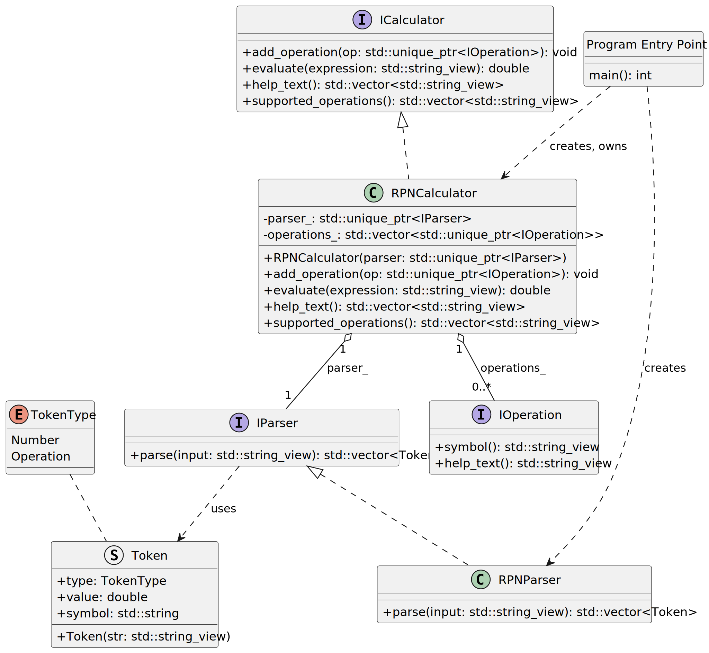
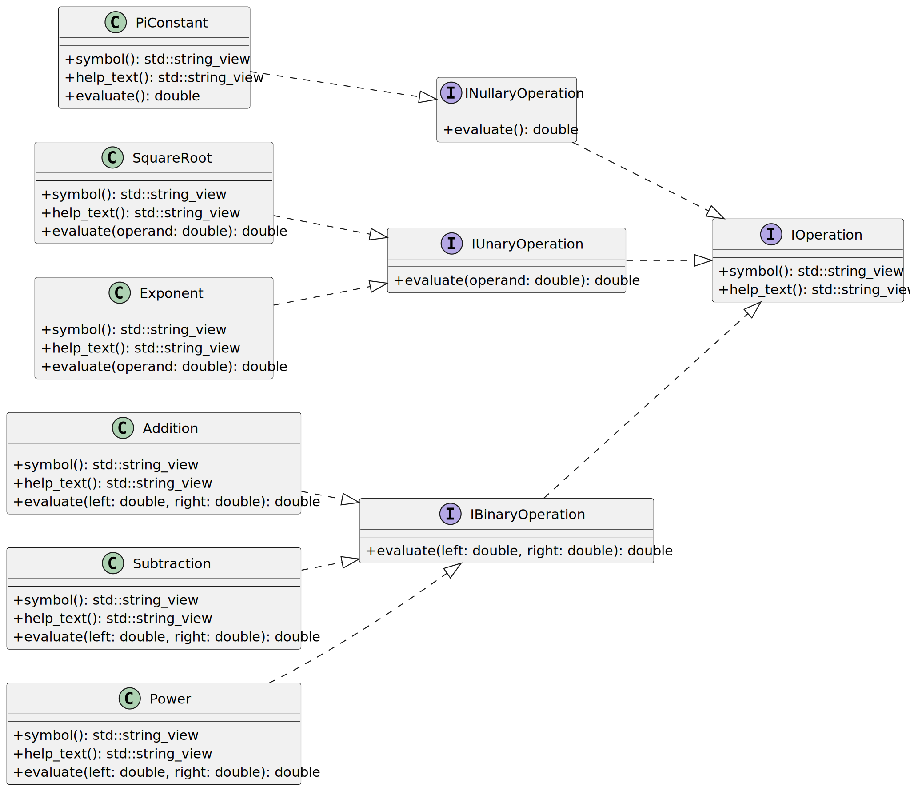

# Advanced Programming Concepts, assignment 2

In this assignment you'll practice the following concepts and skills:

* Classes & inheritance,
* Interfaces & overriding,
* Polymorphism,
* UML class diagrams

Moreover, you will write a program that actually does something (little) useful.

## Grading

You will get 11 points for completing this assignment as specified. Small deviations and mistakes will result in point deductions:

| Deviation / mistake                        | Point deduction |
|--------------------------------------------|-----------------|
| Missing one of the required interfaces     | -2              |
| Class(es) not implementing required interface(s) | -2              |
| Program crashes & terminates for whatever reason | -2              |
| Missing one of the required operations     | -1              |
| Missing required minor functionality (e.g. help command) | -1              |
| Not passing objects through interfaces | -1              |
| Referring to concrete classes instead of interfaces in RPNCalculator| -1              |
| Memory bugs (leaks, dangling pointers, etc.) | -2              |

Extra effort tasks are described at the end of this document. There are three of them:

* Using `std::expected` instead of exceptions for error handling (+3 points),
 
* Using ranges for parsing and help text generation (+2 points),

* Ignoring the whole idea of multiple operation classes and implementing just three general operation classes: `BinaryOperation`, `UnaryOperation`, and `NullaryOperation` (+4 points)

**The extra effort tasks do not extend the required functionality** Instead, they change the way the required functionality is implemented. If you plan to do any of the extra effort tasks, you might want to skip the *normal* implementation of the required functionality and go directly to the extra effort task implementation.

## Warning

> This assignment is a *BIG WALL OF TEXT*. It uses about and introduces some abstract concepts. Read first fully, then start implementing. Ask questions if something is not clear.

The overarching idea of this assignment is to implement a calculator engine in a modular way. That is, instead of writing single monolithic function that evaluates expressions, the program will be broken into multiple classes:

* A parser class that splits user input into tokens,
* Multiple operation classes that implement individual operations (addition, subtraction, square root, etc.),
* A calculator class that uses the parser and the operation classes to evaluate expressions.

Moreover, all classes will implement corresponding interfaces. Consequently, the calculator class will refer to other classes only through their interfaces. So instead of this:

```c++
class Calculator 
{
private:
    Parser parser_;
    std::vector<Operation> operations_;
};
```

You will have this:

```c++
class Calculator 
{
private:
    std::unique_ptr< IParser > parser_;
    std::vector<std::unique_ptr< IOperation >> operations_;
};
```

Yes, there will be unique pointers everywhere. As you know, pointers are necessary for *polymorphism* in C++.

## Short description

Write a program that performs calculations using [Reverse Polish notation](https://en.wikipedia.org/wiki/Reverse_Polish_notation). In RPN operators follow operands, for example "3 + 4" is written as "3 4 +". RPN is a historically important way of representing arithmetical expressions. It doesn't use brackets and operation precedence is unambiguous. Consequently, no parsing of expressions is required, which greatly simplifies program's logic.

Your program will be composed of multiple classes, following the [Single Responsibility Principle](https://en.wikipedia.org/wiki/Single_responsibility_principle). You will have to implement a class that represents the RPN calculator, and a class that validates (and parses) the user input, also there will be classes for all the operations. All these classes will implement corresponding interfaces. In total your program will have to contain around 10 different classes.

Your program must be able to compute the results of simple, single-operation expressions, for example:

* 3 5 + ⇒ 8
* 3 5 / ⇒ 0.6
* 3 sqrt ⇒ 1.7321

And be able to handle longer expressions, for example:

15 7 1 1 + - / 3 * 2 1 1 + + - ⇒ 5


Moreover, things like this will be possible (this calculates `ln( e ^ 2)`):

e_constant 2 ^ ln ⇒ 2

## Requirements

1. Your program must compute the value of arithmetical expressions in the RPN notation.

2. Your program must accept user input in which spaces separate two consecutive tokens (operators and numbers). The syntax is assumed to be always valid. Semantic errors may happen and should be handled.

3. Your program must handle input errors such as invalid arithmetical operations (e.g. division by zero) or unknown operations gracefully. When an error is encountered, the program must print an error message and continue its execution. **Notice that many function in your program are required to throw exceptions, you must catch those exceptions in your `main` function and print the error messages there.**

4. The program must accept and evaluate new expressions in an infinite loop. It should provide means for a user to stop the execution (for example when user types in 'q' instead of an expression). There should be also some help command available that will list the supported operations (e.g. 'h' or 'help').

5. Your program **must have** at least the following classes:
    * `Token`  `struct` that represents a token in the RPN notation. A token can be an operator or a number. For instance, the expression `"3 5 +"` contains three tokens: `[{3, number}, {5, number}, {+, operator}]`.

    * Parsing / validating class (`RPNParser`): this class takes a string, e.g.: `"3 5 +"` and checks whether it's a valid RPN expression, splitting it into a `std::vector` of `Token`s.
  
    * `RPNCalculator` -- the class that evaluates an RPN expression. It takes a `std::string_view` containing an expression, computes the result. It also provides means for a user to ask what operations are supported.
  
    * Individual operation classes, for example `Addition`, `Subtraction`, `SquareRoot`, etc. Each operation class implements a common interface (e.g. `IOperation`).

6. Your program must be written in a modular way. All the objects should be be able to be instantiated and used independently. For instance, you can create a `Parser` object and use it to parse an expression, without having to instantiate a `RPNCalculator` object.

7. All classes in your program **must implement corresponding interfaces**. For instance, the `RPNCalculator` class must implement an `ICalculator` interface that defines the functions and properties of the calculator. Similarly, the `Parser` class must implement an `IParser` interface.

8. Your program **should only create new objects in its `main` function**. This means, for example, that the `RPNCalculator` class doesn't create the operation objects by itself in its constructor. Instead, all objects are created in the `main` function and connected together. Like in the example below:

    ```c++
    int main()
    {
        // create the parser
        auto parser = std::make_unique<RPNParser>();
        
        // create the calculator, passing the parser to it
        std::unique_ptr<ICalculator> calculator = std::make_unique<RPNCalculator>( std::move(parser) );

        // add operations to the calculator
        calculator->add_operation(std::make_unique<Addition>());
        calculator->add_operation(std::make_unique<Subtraction>());
        calculator->add_operation(std::make_unique<Pi>());
        calculator->add_operation(std::make_unique<Sqrt>());
    }
    ```

    Such a mechanism is called [dependency injection](https://en.wikipedia.org/wiki/Dependency_injection). It's commonly applied in OO programs to achieve better flexibility.

10. Your program must be neatly separated into files. Specifically, each class must be defined in its own header file. Two provisions apply:

    * You are allowed to also keep the implementation in header files. Otherwise it will be too many.

    * You are allowed to put all you operation classes in a single header file, e.g. `operations.hpp`. Otherwise it will be too many.

## Dependency injection

Your program **must use** the dependency injection. When using the dependency injection, no class should be allowed to create other objects that it uses to provide its functionality. For instance, the `RPNCalculator` class isn't allowed to create an `RPNParser` or `Addition` object. Instead, it receives those objects as constructor parameters, or they are passed to it through a special function (`RPNCalculator::add_operation` in the example above).

To make the design even more flexible all objects are passed through interfaces. That means that the `RPNCalculator` class doesn't refer to the `RPNParser` class directly. It only knows about the `IParser` interface, which is implemented by the `RPNParser` class. Consequently, the parameter `parser` in the `RPNCalculator` constructor is of type `std::unique_ptr<IParser>`. Also, the private field (e.g. `parser_`) in the `RPNCalculator` class is of type `std::unique_ptr<IParser>`.

This only works with *polymorphic types*, which is why all classes in your program must implement corresponding interfaces. In C++, a *polymorphic type* is a class that has at least one `virtual` function. Objects of *polymorphic types* can be referred to through pointers (including `std::unique_ptr`) or references of their base types (interfaces).

The dependency injection principle allows you to easily change the functionality of the program without changing the **existing code** of the program itself. For instance you can change the implementation of the `Parser` class by creating a new class that implements the `IParser` interface and pass this new class to the `RPNCalculator` class as a parameter (or even set it through a function!).

The example below shows how the `RPNCalculator` class can be designed to use dependency injection for receiving the `IParser` object and the operation objects.

```c++
class RPNCalculator: public ICalculator
{
public:
    RPNCalculator( std::unique_ptr<IParser> parser )
        : parser_( std::move( parser ) )
    {
    }

    void add_operation( std::unique_ptr<IOperation> operation ) override
    {
        operations_.push_back( std::move( operation ) );
    }

private:
    std::unique_ptr<IParser> parser_;
    std::vector<std::unique_ptr<IOperation>> operations_;
};
```

## Example design & walkthrough

### Main design

In the figure below the *partial* class diagram of the RPN program is shown. You must follow this design in your assignment.



You can see a (big) png version of the diagram [here](./img/rpn_calc.png).

The first thing to notice is that the `main()` class creates all the other objects, specifically:

* The `RPNCalculator` object,

* The `Parser` object

After creating all the objects, the `main` function enters an infinite loop in which it accepts user input and passes it to the `RPNCalculator` object for evaluation. 

Notice that all classes implement corresponding interfaces. 

#### `Token`

This class represents a token in the RPN notation. A token can be an operator or a number. A `TokenType` enum is used to distinguish between the two. The constructor of the class takes a `string_view` (e.g. "3" or "sqrt") and tries to parse it into a number. If parsing is successful, the token type is set to `Number` and the parsed numeric value is stored in a corresponding data member. Otherwise the token type is set to `Operation`. The string representation of the token is always stored in the `symbol` data member.

#### `Parser`

The `Parser` class is responsible for parsing user input and (possibly) validating it. It has one function, `parse`, that takes a `string_view` containing the user input (e.g. "3 5 +") and returns a `std::vector` of `Token`s. 

> If the input is not valid, the `parse` function must throw a `std::domain_error` (might be not applicable in your design).


#### `RPNCalculator`

The `RPNCalculator` class is responsible for evaluating an RPN expression. Its `evaluate` function takes an RPN expression, parses it using a parser object and computes the result. `RPNCalculator` also provides means for a user to ask what operations are supported (the `supported_operations` function, e.g. `{"+", "-", "sqrt"}`). Moreover, it has a `help_text` function that returns a `std::vector<std::string_view>` of strings with help text for the supported operations. A single item in this vector is a line of help text for a single operation, e.g.: `"sqrt: square root - calculates the square root of a number"`.

> The `evaluate` function of the `RPNCalculator` must throw a `std::domain_error` if it encounters an invalid expression (e.g. not enough operands for an operation, unknown operation symbol, etc.).

### Operations

All the operations supported by the calculator implement the `IOperation` interface. This interface defines the following functions:

```cpp
struct IOperation {
    virtual ~IOperation() = default;
    virtual std::string_view symbol() const = 0;
    virtual std::string_view help() const = 0;
};
```

The `symbol` function returns the symbol of the operation (e.g. "+", "sqrt", etc.). The `help` function returns a string with help (e.g., "+: addition - adds two numbers").

Notably, `IOperation` doesn't define a function for executing the operation. This is because different operations require different number of operands:

* Binary operations (e.g. addition, subtraction, multiplication, division, exponentiation) require two operands,
* Unary operations (e.g. square root, logarithm, exponent with base e) require one operand,
* Nullary operations (e.g. Pi constant, e constant) require no operands.

To accommodate this, three separate interfaces are defined that inherit from `IOperation`: `IBinaryOperation`, `IUnaryOperation`, and `INullaryOperation`. Each of these interfaces defines an `evaluate` function with the appropriate number of parameters, e.g.:

```cpp
struct IUnaryOperation : public IOperation {
    virtual double evaluate(double operand) const = 0;
};
```

#### Supported operations

All the supported operations implement one of these three interfaces. E.g.:

```cpp
struct Addition : public IBinaryOperation {
    std::string_view symbol() const override { return "+"; }
    std::string_view help() const override { return "+: addition - adds two numbers"; }
    double evaluate(double left, double right) const override { return left + right; }
};
```

The following operations must be supported by your calculator:

* Addition (`+`): adds two numbers
* Subtraction (`-`): subtracts two numbers
* Multiplication (`*`): multiplies two numbers
* Division (`/`): calculates the fraction of two numbers
* Power (`^`): calculates the power of two numbers
* Square root (`sqrt`): calculates the square root of a number
* Exponentiation (`exp`): calculates the exponent with the natural base e
* Logarithm (`ln`): calculates the natural logarithm of a number
* Pi constant (`Pi_constant`): represents the mathematical constant π
* e constant (`e_constant`): represents the mathematical constant e

> All binary and unary operation must throw a `std::invalid_argument` exception if the input arguments are not valid (e.g. division by zero, logarithm of a negative number, etc.).

#### Class diagram of operations

(Not all required operations are shown in the diagram below, only a few examples.)



You can see a (big) png version of the diagram [here](./img/rpn_operations.png).

## Interaction example

Below you can see an example interaction with the program. User input is prefixed with `>`.

~~~text
RPN Calculator
Enter an RPN expression to evaluate.
Enter '(h)elp' for help.
Enter '(o)ps' for available operations.
Enter '(q)uit' to exit.

> h
Enter expressions using RPN notation, for instance to calculate:
  2 + 3 * 4
  enter '2 3 4 * +'
  or enter '3 + 4 * 2 +'
enter (o)ps to see available operations

> o
Calculator operations:

   + - (Addition) adds two numbers
   - - (Subtraction) subtracts two numbers
   * - (Multiplication) multiplies two numbers
   / - (Division) calculates the fraction of two numbers
   ^ - (Power) calculates the power of two numbers
sqrt - (SquareRoot) calculates the square root of a number
 exp - (Exponentiation) calculates the exponent with the natural base e
  ln - (Logarithm) calculates the natural logarithm of a number

> 3 4 2 * 1 5 - 2 3 ^ ^ / +
  
  3.0001220703125

> q

  Calculator is quitting. Bye!
~~~


## Ideas and hints


#### `RPNCalculator`

The `RPNCalculator` defines a function `evaluate` that takes a string with an RPN expression. The calculator must first parse the expression using the parser object that it holds. For example, if the user enters:

```text
User enters:
3 4 5 + * sqrt
```

After parsing (or rather tokenizing), the corresponding vector of tokens is:

```c#
std::vector<Token>{ 
    {TokenType.Number, 3, "3"}, 
    {TokenType.Number, 4, "4"}, 
    {TokenType.Number, 5, "5"}, 
    {TokenType.Operation, 0, "+"}, 
    {TokenType.Operation, 0, "*"}, 
    {TokenType.Operation, 0, "sqrt"}
};
```

In the `evaluate` function the calculator must iterate over this list, pushing the numbers (operands) on a stack (e.g.: `std::vector<double>`). When it encounters an operator, it must:

* pop zero, one or two operands from the stack (depending on how many arguments the operation needs),

* execute the corresponding operation on those number(s),

* push the result back on the stack.

If the expression is correct, after executing all the operations there should be exactly one number on the stack - the result of the expression.

For the tokens: `"3", "4", "5", "+", "*", "sqrt"` the stack evolution is:

| token | stack before | stack after | comment |
|:-----:|--------------|-------------|---------|
|   3   | []           | [3]         | `3` pushed |
|   4   | [3]          | [3, 4]      | `4` pushed |
|   5   | [3, 4]       | [3, 4, 5]   | `5` pushed |
|   +   | [3, 4, 5]    | [3, 9]      | `5` and `4` popped, `4+5=9` pushed |
|   *   | [3, 9]       | [27]        | `9` and `3` popped, `3*9=27` pushed |
|  sqrt | [27]         | [5.1961]    | `27` popped, `sqrt(27)=5.1961` pushed |

Since there's only one number on the stack after the last operation, the result of the expression is this number (`5.1961`).

#### Finding the right operation

When the calculator encounters an operator token (e.g. "+"), it must find the corresponding operation object in its list of operations. It can do this by iterating over the list of operations and comparing the `symbol()` of each operation with the symbol of the token. When a match is found, the operation can be executed.

You can, naturally, optimize this search, e.g. by using a `std::unordered_map<std::string, std::unique_ptr<Operation>>` that maps operation symbols to operation objects. However, this is not required for this assignment.

#### Performing the operation

When the calculator finds the right operation object, it must cast it to the appropriate interface (`IBinaryOperation`, `IUnaryOperation`, or `INullaryOperation`). Since the *arity* (number of operands) of an operation is not known, the calculator must use `dynamic_cast` to try to cast the operation object to each of the three interfaces. When the cast is successful (i.e. it doesn't return `nullptr`), the calculator knows how many operands to pop from the stack and can execute the operation. For example:

```c++
// assume the existence of a private function:
IOperation* RPNCalculator::find_operation(const std::string_view symbol);

for (auto& token: tokens)
{
    if (token.type == TokenType::Number)
    {
        stack.push_back(token.value);
    }
    else if (token.type == TokenType::Operation)
    {
        IOperation* operation = find_operation(token.symbol);
        if (operation == nullptr)
        {
            throw std::domain_error("Unknown operation: " + std::string(token.symbol));
        }

        // try nullary
        if (auto nullary_op = dynamic_cast<INullaryOperation*>(operation))
        {
            stack.push_back(nullary_op->evaluate());
        }
        // try unary
        else if (...)
        {
            /*...*/
        }
        // try binary
        else if (...)
        {
            /*...*/
        }
    }
}
```

## Extra effort tasks

### Using `std::expected` instead of exceptions for error handling (+2.5 points)

You were required to use exceptions everywhere for errors. However, modern C++ provides an alternative mechanism for error handling: [`std::expected`](https://en.cppreference.com/w/cpp/utility/expected). It's more explicit and readable than exceptions, and it's becoming more and more popular. With `std::expected`, functions return either a valid result or an error object. For example, the `evaluate` function of the `RPNCalculator` class can be changed to return a `std::expected<double, std::string>` instead of throwing exceptions:

```c++
class RPNCalculator : public ICalculator {
public:
    std::expected<double, std::string> evaluate(std::string_view expression) override;
    {
        /*...*/

        // There is not exactly one element on the stack after evaluating expression
        if (stack.size() != 1)
            return std::unexpected("Invalid expression: incorrect number of operands");
        else
            return stack.back();
    }
};


int main()
{
    /*...*/
    auto result = calculator->evaluate(user_input);
    if (!result)
    {
        std::cerr << "Error: " << result.error() << std::endl;
    }
    else
    {
        std::cerr << "Result: " << *result << std::endl;
    }
}
```

#### Task

Replace all the exception-based error handling in your program with `std::expected`. Make sure that all functions that can fail return a `std::expected` instead of throwing exceptions. 

### Using ranges for parsing and help text generation (+2.5 points)

Most likely, when parsing in the `RPNParser` and when creating vector with help text or supported operations in the `RPNCalculator`, you used loops. Now, you will use ranges instead. Ranges allow for transforming this kind of code:

```c++
std::vector<int> squared_odds{};

for (int n : numbers)
{
    if (n % 2 != 0)
    {
        squared_odds.push_back(n * n);
    }
}
```

Into this:

```c++
auto squared_odds = numbers
    | std::views::filter([](int n) { return n % 2 != 0; })
    | std::views::transform([](int n) { return n * n; })
    | std::ranges::to<std::vector<int>>();
```

#### Task

Fix all the functions in your program that loop over a range of items to use `std::ranges` and `std::views` instead. Specifically, the following functions must be changed to use ranges:

* `RPNParser::parse` function,
* `RPNCalculator::help_text` function,
* `RPNCalculator::supported_operations` function.

You might this one useful [https://en.cppreference.com/w/cpp/ranges/basic_istream_view.html](https://en.cppreference.com/w/cpp/ranges/basic_istream_view.html)

### Ignoring the whole idea of multiple operation classes and implementing just three general operation classes: `BinaryOperation`, `UnaryOperation`, and `NullaryOperation` (+4 points)

Let's be honest, this whole thing with tens of different operation classes is an ugly, smelly business. What if instead of that, you could have just three general operation classes: `BinaryOperation`, `UnaryOperation`, and `NullaryOperation`? And perhaps use them like this:

```c++
class BinaryOperation  : public IOperation { /* magic sauce */ };
class UnaryOperation   : public IOperation { /* magic sauce */ };
class NullaryOperation : public IOperation { /* magic sauce */ };

template<typename Callable>
std::unique_ptr<IOperation> make_operation(const std::string_view symbol, const std::string_view help_text, Callable func)
{
    /* Lots of magic sauce */
}


int main()
{
    /*...*/
    calculator->add_operation( make_operation("+", "addition - adds two numbers", [](double a, double b) { return a + b; }) );
    calculator->add_operation( make_operation("sqrt", "square root - calculates the square root of a number", [](double a) { return std::sqrt(a); }) );
    calculator->add_operation( make_operation("Pi_constant", "mathematical constant π", []() { return 3.141592653589793; }) );
}
```

#### Task

Well, make this dream come true!

Implement the three general operation classes: `BinaryOperation`, `UnaryOperation`, and `NullaryOperation`. Each of these classes must implement the `IOperation` interface. Each of them will also need to be able to hold a *function pointer* so that they can store and execute the actual operation (passed to them as a lambda expression in the example above).

Implement a `make_operation` function template that creates and returns an operation object of the appropriate type. The function takes the operation symbol, help text, and a callable object (function pointer, lambda expression, etc.) as parameters. Based on the type of the callable object (i.e. how many parameters it takes), the function creates an instance of `BinaryOperation`, `UnaryOperation`, or `NullaryOperation`, initializes it with the provided symbol, help text, and callable object, and returns it as a `std::unique_ptr<IOperation>`.

> If you are having trouble figuring out how to determine the number of parameters of a callable object, consider passing an extra parameter to the `make_operation` function that indicates the arity of the operation (e.g. an integer) for a one point penalty. Or just talk to us!
